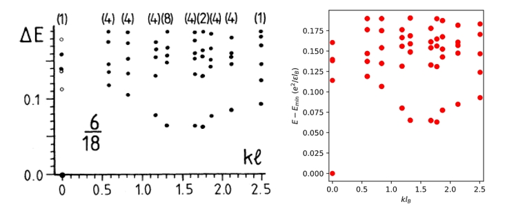

# 🔧 EDHamPy

**EDHamPy** (*Eat Ham Pie* or in French *manger de la quiche*) is a Python-based, highly parallelized **Exact Diagonalization (ED)** package tailored for solving various many-body quantum physics problems. It currently supports simulation of **Fractional Quantum Anomalous Hall (FQAH)** systems on models with crystal lattice translation symmetry and **Fractional Quantum Hall (FQH)** systems on **torus geometry**.

---

## 📌 Project Overview

- 🔬 **Core purpose**: Perform efficient exact diagonalization of strongly correlated systems using highly parallel sparse matrix methods.
- 🚀 **Performance**: In many cases, EDHamPy matches or exceeds the performance of state-of-art ED packages like [DiagHam](https://www.nick-ux.org/diagham).
- ⚙️ **Scope**: Currently focused on computing many-body energy spectra. Future support for additional observables is planned. An object-oriented re-programming is also envisioned. 

---

## 👨‍💻 Contributors

- **Project Creator**: Xin Lu
- **Core Developers**: Xin Lu, Min Li
- **Special Thanks**: 
  - Jianpeng Liu, Zhongqing Guo and Yanran Shi: Provided benchmark references and helpful discussions on FQAH simulations. In particular, Xin Lu works as Research Assistant Professor in Prof. Jianpeng Liu’s group at ShanghaiTech University at the moment of the project kickoff.
  - Guillaume Roux: Initiated Xin Lu on the technique of Exact Diagonalization. Xin Lu received, as Master 2 student, his lectures at ICFP in France during the [Numerical Physics course](http://www.lptms.universite-paris-saclay.fr/wiki-cours/index.php/ICFP_NumPhys_Paris). 

---

## ✨ Features

- Supports exact diagonalization for:
  - **Fractional Quantum Hall states** on torus geometry
  - **Fractional Chern Insulator / Anomalous Hall states**
- Parallelized sparse matrix diagonalization (MPI-based)
- Multiple Lanczos-type algorithms available: Trivial Lanczos, Partial Reorthogonalization, Partial Reorthogonalization with Cauchy Convergence criterion, Partial Reorthogonalization with Residual Value Monitorning

---

## 🛠 Installation

### Step 1: Set up Python environment
We recommend using the most recent Anaconda distribution. 

### Step 2: Install dependencies

- **`mpi4py`**: for distributed computation
- **`numba`**: no-python mode for fast local computation

* * *

📂 Project Structure
--------------------

```Plain text
EDHamPy/
├── QHE_Torus/             # ED codes for FQHE on torus
├── Lattice_Torus/         # ED codes for FQAHE
├── benchmark/             # Examples for benchmark
├── LICENSE                # MIT License
└── README.md              # Project documentation
```

* * *

📊 Benchmark
------------

### Example: FQHE  for electrons at  $\nu=1/3$  of  the  zeroth Landau level



Perfect agreement with well-known many-body spectra of FQHE at $\nu=1/3$ on torus. The left panel is copied from [Haldane’s work](https://journals.aps.org/prl/abstract/10.1103/PhysRevLett.55.2095) and the right panel shows the results computed using EDHamPy taking advantage of many-body translation symmetry, as explained in the paper mentioned before.

### Performance 

EDHamPy has been benchmarked against well-established ED packages such as [DiagHam](https://www.nick-ux.org/diagham) on FQAHE simulations. It shows perfect agreement and, in some scenarios, superior performance.

* * *

🔒 License
----------

MIT License. You are free to use, modify, and distribute this package with proper attribution.

* * *

🤝 Contribution
---------------

We welcome collaboration and feedback. Please open an issue or submit a pull request if you find bugs or have feature requests.

* * *

📬 Contact
----------

For questions or collaborations, please contact:

*   **Xin Lu**: lvxin@shanghaitech.edu.cn
